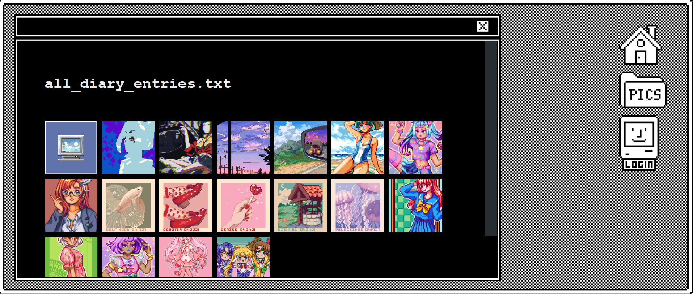
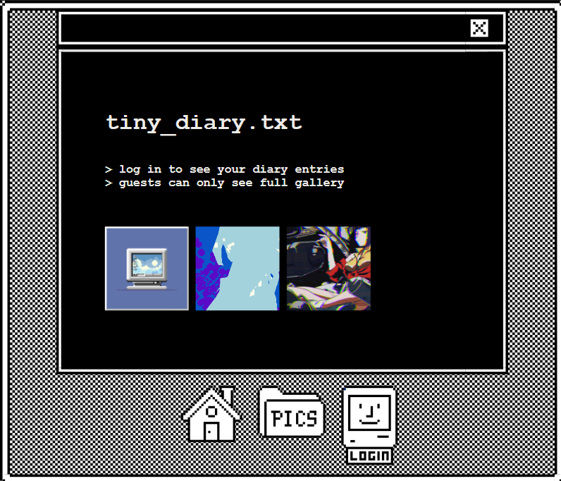
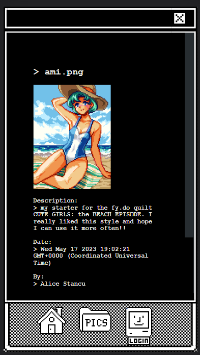

# 🟧🟨Tiny_Diary.txt🟦🟪

## Tiny_Diary 
Tiny_Diary is an art diary and a simple social media app for artists, especially those focusing on lo-fi or pixel art. 

## Screenshots
### desktop display:  

## tablet display:  

### phone display:  

## Technologies used:
- HTML
- CSS
- JavaScript
- Node.js
- Express.js
- Mongoose ODM
- MongoDB
- OAuth 2.0
- fly.io

## Getting Started
[TinyDiary](https://tinydiary.fly.dev/)
- without signing in, you can view all diary entries made by others
- signing in with google OAuth 2.0 you can also upload, edit, delete and view your diary entries.
- to add a diary entry, provide a URL to your art piece (e.g., from Discord or imgur) and give it a title

## Next Steps
- having the ability to upload and store images without relying on an external service such as imgur 